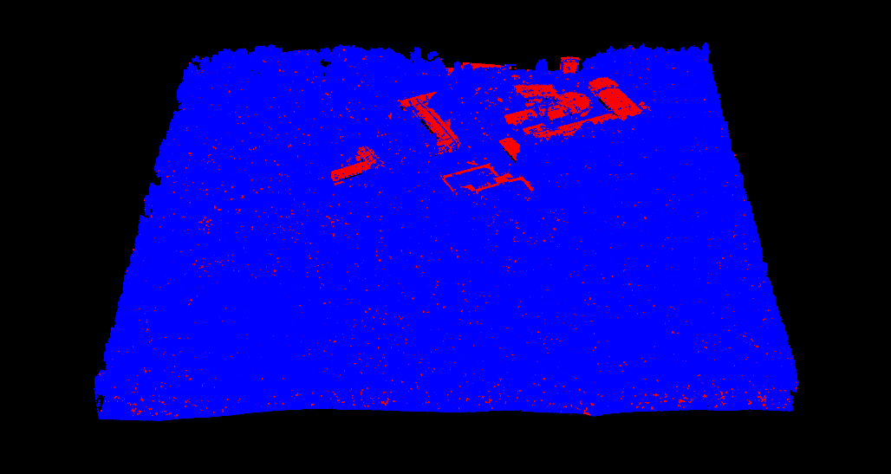

\

> 🛈 Information: This project was hosted at [GitHub]().

> 🗃️ Data: [20 LiDAR scanning tiles]()

> 📒 abstract: The study aims to create a forest biomass map in Eberswalde, Germany based on mean top-of-canopy height (TCH) raster model. [In the first step](#step1), a point cloud of Traunstein forest and inventory data were used to derive TCH-to-biomass relationship in Traunstein forest. We assume that the TCH-to-biomass relationship in Traunstein forest is similar with that of Eberswalde forest. With this assumption, [in the second step](#step2), using the Traunstein TCH-to-biomass relationship to predict or map biomass in Eberswalde.

\

# Prepare workspace

> 📝 note: To ensure reproduce R environment, this project provide *renv* and *R-4.02* folder.

```{r eval=FALSE}
# check working directory
getwd()

# Check path which R loads the packages from
.libPaths()

# change path to renv folder which R should loads packages from
getwd()
.libPaths(new=paste0(getwd(), "/renv/library/R-4.0/x86_64-w64-mingw32"))
.libPaths()

# load packages
library(data.table)
library(raster)
library(rgl)
library(lidR)
library(slidaRtools)

## prepare parallel processing with lidR
# get how many CPU threads lidR using
get_lidr_threads()
# set how many threads lidR should use
set_lidr_threads(0.8) # recommended to use maximum 80% of total threads
# check how many CPU threads lidR using again
get_lidr_threads()

```

\

# 1. Derive TCH-to-biomass relationship in Traunstein forest {#step1}

```{r}
# load Traunstein point cloud as dataframe
pc.df <- readRDS("data\\Traunstein\\Subplot_PointCloud_Transformed.rds")
head(pc.df)
```

```{r eval=FALSE}
# see point cloud in 3D
display.point.cloud(pc.df, size=2)
```


```{r}
# derive canopy height model (CHM) from point cloud
chm.ras <- raster.from.point.cloud(pc.df, res=1, func="max")
plot(chm.ras)
chm.ras
```

```{r}
# Convert (melt) the CHM from a raster into to a XYZ-table
chm.df <- ras2xyzdf(chm.ras)
head(chm.df)
```

```{r}
# Assign spatial grid indices (to each CHM pixel) with a plot resolution of 50 m
chm.df$SpatID <- calc.spatial.index(xcor=chm.df$X, ycor=chm.df$Y, res=50)
head(chm.df)
tail(chm.df)
display.point.cloud(chm.df, col.var="SpatID", col.lim=c(1, 72))
```


```{r}
# Aggregation to get mean Z of each 50-m plot (which is TCH)
chm.dt <- data.table(chm.df)
head(chm.dt)
agg.chm.dt <- chm.dt[, .(TCH = mean(Z, na.rm=T)), keyby=SpatID]
head(agg.chm.dt)
```

```{r}
# Load Traunstein inventory data
inv.df <- readRDS("Data\\Traunstein\\Subplot_Inventory.rds")
head(inv.df)
```

```{r}
# Assign spatial grid indices (to each tree) with a plot resolution of 50 m
inv.df$SpatID <- calc.spatial.index(xcor=inv.df$X, ycor=inv.df$Y, res=50)
head(inv.df)

```

```{r}
# Aggregation to get sum of biomass of single trees in each 50-m plot (which is AGB)
inv.dt <- data.table(inv.df)
head(inv.dt)
agg.inv.dt <- inv.dt[, .(AGB = sum(AGB, na.rm=T)), keyby=SpatID]
head(agg.inv.dt)

```

```{r}
# Sort table by column SpatID 
setorderv(agg.inv.dt, cols=c("SpatID"))
agg.inv.dt

# Convert biomass from tons per quarter hectare to tons per hectare (which is the standard unit for AGB)
agg.inv.dt$AGB <- 4*agg.inv.dt$AGB
agg.inv.dt

# Make scatterplot of biomass over height
plot(agg.inv.dt$AGB ~ agg.chm.dt$TCH, xlim=c(0, 30), ylim=c(0, 450))

# Combine the AGB column from the inventory table and the TCH column from the CHM table
metrics.dt <- cbind(agg.inv.dt, TCH=agg.chm.dt$TCH)
head(metrics.dt)

# Use nls function to fit power law
nls.AGB.TCH <- nls(AGB ~ a*TCH^b, data=metrics.dt, start=expand.grid(a=0.5, b=2))
a <- coef(nls.AGB.TCH)[1]
b <- coef(nls.AGB.TCH)[2]
curve(a*x^b, add=T, col="red")
```

\

# 2. Preprocessing Eberswalde forest point cloud

```{r}
# Load the Eberswalde lidar data
ew.las <- lidR::readLAS("data\\Eberswalde\\419500_5853000.laz")

# Get only the lidar data.table from the las object
ew.dt <- ew.las@data
head(ew.dt)

# Plot the point cloud
plot(ew.las)
```


The study area in Eberswalde includes ground and building area which are not our interest for biomass mapping. In the next steps, we classify the point cloud and set height values of points classified as ground or building to 0. 

```{r}
# Classify ground returns
ew.las <- classify_ground(ew.las, algorithm=csf())

# check classification
table(ew.las$Classification)

# Classify buildings and planar areas
ew.las <- segment_shapes(las=ew.las, 
                         algorithm=shp_plane(k=10), 
                         attribute="planar",
                         filter= ~Classification != 2L)
# Label all points as buildings, for which 20% or more of their neighbors are planar
metrics <- point_metrics(ew.las, ~list(PlanarNeighborhood=mean(planar)), k=10)  
ew.las <- add_attribute(ew.las, x=ifelse(metrics$PlanarNeighborhood < 0.2, 0, 1), 
                        name="Building")

# check classification
head(ew.las)
table(ew.las$Building)
table(ew.las$planar)

# plot Eberswalde point cloud with building coloring
plot(ew.las, color = "Building")
```


```{r}
# plot Eberswalde point cloud with building coloring
plot(ew.las, color = "planar")
```



```{r}
# Terrain normalize the point cloud
norm.ew.las <- lidR::normalize_height(ew.las, knnidw())
plot(norm.ew.las)
plot(norm.ew.las, color = "Building")
```


```{r}
## Set all building points to 0 height
# Get the data.table from the las object
norm.ew.dt <- norm.ew.las@data
# Convert to data.frame
norm.ew.df <- data.frame(norm.ew.dt)
# Set all building points to height 0 
norm.ew.df[norm.ew.df$Building == 1, "Z"] <- 0
# Set all points planar area to height 0 
norm.ew.df[norm.ew.df$planar, 'Z'] =0
# Check if the buildings have disappeared
display.point.cloud(norm.ew.df)
```


```{r}
# create CHM for Eberswalde forest
ew.chm.ras <- raster.from.point.cloud(norm.ew.dt, res=1, func="max")
ew.chm.ras
plot(ew.chm.ras)
```

\

# 3. Using the Traunstein TCH-to-biomass relationship to predict or map biomass in Eberswalde {#step2}

There are 2 approaches:

## 3.1. Raster aggregate: the fast solution

This is a very fast solution, because TCH is a raster metric, which can be calculated directly using raster aggregation. For a more general solution using XYZ-table conversion and spatial indexing (second approach). The more general solution can be applied to raster metrics and point cloud metrics (e.g., MCH).

```{r}
# Aggregate CHM raster for mean top-of-canopy height (TCH)
tch.50m.ras <- raster::aggregate(ew.chm.ras, fact=50, fun=mean)
plot(tch.50m.ras)

# Predict Eberswalde biomass (AGB) from TCH using Traunstein TCH-to-biomass relationship
agb.50m.ras <- a*tch.50m.ras^b
plot(agb.50m.ras)
hist(agb.50m.ras)

# Assign CRS to raster
crs(agb.50m.ras) <- CRS("+init=epsg:32633")

```


## 3.2. Spatial indexing: the versatile preference

This approach does not use raster aggregation. Instead conversion to XYZ-table and spatial indexing is used. This solution is not restricted to raster metrics, i.e., it also works for making maps from point cloud metrics.

```{r}
# Convert the CHM to a XYZ-table
ew.chm.df <- ras2xyzdf(ew.chm.ras)
head(ew.chm.df)

# Calculate spatial ID for the CHM data.frame (i.e. each raster pixel)
ew.chm.df$PlotID <- calc.spatial.index(xcor=ew.chm.df$X, ycor=ew.chm.df$Y, res=50)
head(ew.chm.df)

# Aggregate the CHM for top-of-canopy height (TCH)
ew.chm.dt <- data.table(ew.chm.df)
agg.ew.tch.dt <- ew.chm.dt[,.(TCH=mean(Z, na.rm=T)), by='PlotID']
agg.ew.tch.dt

# Predict biomass from TCH by applying the power law coefficients
# a and b, which we have fitted earlier on the Traunstein data
agg.ew.tch.dt$AGB <- a*agg.ew.tch.dt$TCH^b
head(agg.ew.tch.dt)

## Make a map of biomass with each pixel representing 50 m x 50 m
# First make a matrix with the AGB values
agb.mx <- matrix(agg.ew.tch.dt$AGB, nrow=10, ncol=10)

# Convert to raster
agb.50m.ras2 <- raster(agb.mx)
plot(agb.50m.ras2)

# The raster shows the typical 90 degree rotation of matrix-to-raster conversion. Rotate it back by 90 degrees by transposing it (diagonal reflection) and  then flipping it upside down (horizontal reflection)
agb.50m.ras2 <- t(agb.50m.ras2)
plot(agb.50m.ras2)
agb.50m.ras2 <- flip(agb.50m.ras2, direction="y")
plot(agb.50m.ras2)

# Set the extent of the raster to correct UTM coordinates
agb.50m.ras2 <- setExtent(agb.50m.ras2, extent(ew.chm.ras))
plot(agb.50m.ras2)

# Assign the coordinate system to the raster
crs(agb.50m.ras2) <- CRS("+init=epsg:32633")

# let compare the biomass map from two approach
par(mfrow = c(1,2)) # create a 1 row x 2 column plotting matrix
plot(agb.50m.ras, main='approach 1')
plot(agb.50m.ras2, main='approach 2')

```


